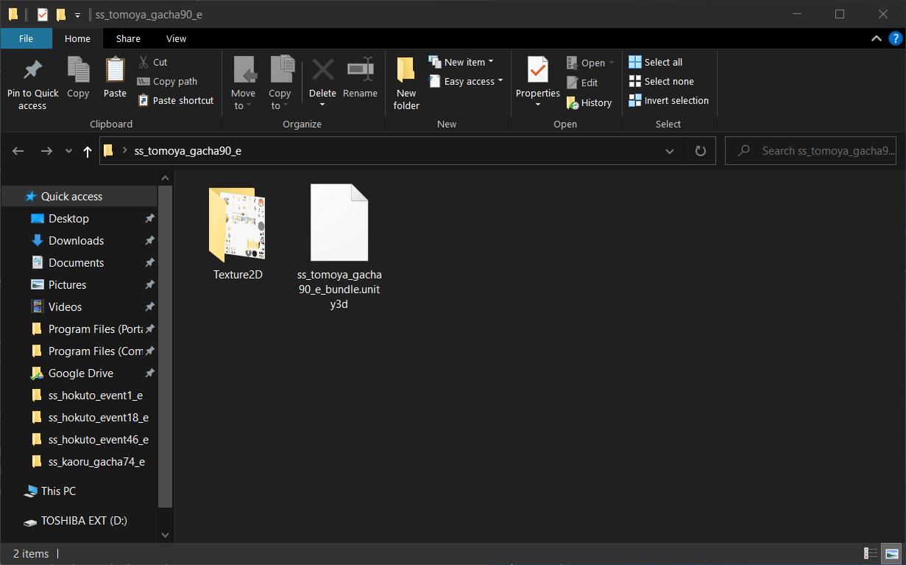

# Making and Uploading EnStB's Sprite Studio Mini Characters to the wiki

## Prerequisites

- Unity3d files from Rai's folder
  - [! Era](https://drive.google.com/drive/folders/1D4AqhC1iGJW_OSIZI637pWKEyrJtoP5m?usp=sharing) | [!! Era](https://drive.google.com/drive/folders/1botmhyMSbQyBsUFf0NMuj1ittAdgv-Zh?usp=sharing)
  - These are from *Japanese EnStars* due to how the Chinese version has various glitches and coloration issues
- [AssetStudio](https://github.com/Perfare/AssetStudio/releases)
- [Unity Assets Bundle Extractor](https://github.com/DerPopo/UABE/releases)
- [Photoshop](https://www.adobe.com/products/photoshop.html)
  - WINDOWS USERS: You can use [GenP](https://cdn.discordapp.com/attachments/841024507312341033/859009057577500702/Adobe-GenP-2.7.zip) to patch any Adobe application
- A lot of patience

## Removing Shadows from SS Sprites

While this is optional, it's my personal preference to remove shadows from the sprites. The colors for them are quite inconsistent anyways.

1. Load up your desired file onto AssetStudio
2. Navigate to the file's `Asset List` and export the texture for the sprite (named `base`)

  - I personally place the files in a folder so it's more organized, like so
    
3. Open Photoshop and erase the shadow. It's always in the same spot

WIP
