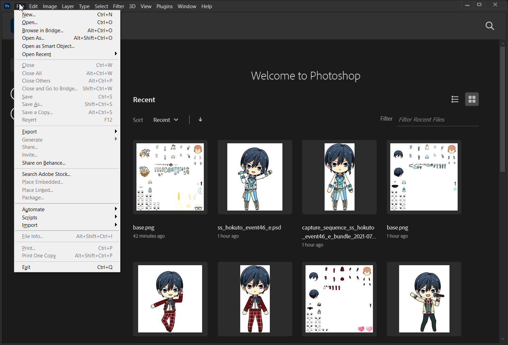

# Making SpriteStudio Assets for the Wiki

### Table of Contents
- [Prerequisites](#prerequisites)
- [Removing Shadows from SS Sprites](#removing-shadows-from-ss-sprites)
- [Making a Mini Chara image](#making-a-mini-chara-image)
- [Making 5\* Motion GIFs](#making-5-motion-gifs)
- [Converting into WebP](#converting-into-webp)
- [Converting into Apng](#converting-into-apng)
- [Notes](#notes)

## Prerequisites

- Unity3d files from Rai's folder
  - [! Era](https://drive.google.com/drive/folders/1D4AqhC1iGJW_OSIZI637pWKEyrJtoP5m?usp=sharing) \| [!! Era](https://drive.google.com/drive/folders/1botmhyMSbQyBsUFf0NMuj1ittAdgv-Zh?usp=sharing)
  - These are from *Japanese EnStars* due to how the Chinese version has various glitches and coloration issues
- [AssetStudio](https://github.com/Perfare/AssetStudio/releases)
- [Unity Assets Bundle Extractor (UABE)](https://github.com/DerPopo/UABE/releases)
- [Photoshop](https://www.adobe.com/products/photoshop.html)
  - WINDOWS USERS: You can use [GenP](https://cdn.discordapp.com/attachments/841024507312341033/859009057577500702/Adobe-GenP-2.7.zip) to patch any Adobe application
- [Rai's SS Animator for Unity](https://docs.google.com/document/d/1GrEY0CvLlToShug5bfooeV-Vryjsh0KhZSBT3-VA_uI/edit)
- A lot of patience

## Removing Shadows from SS Sprites

While this is optional, it's my personal preference to remove shadows from the sprites. The colors for them are quite inconsistent anyways.

1. Load up your desired file onto AssetStudio
2. Navigate to the file's `Asset List` and export the texture for the sprite (named `base`)

  - I personally place the files in a folder so it's more organized, like so
  ```
  ss_tomoya_gacha90_e
  ├── Texture2D
  │   └── base.png
  └── ss_tomoya_gacha90_e_bundle.unity3d
  ```
3. Open Photoshop and erase the shadow. It's always in the same spot

  - This is where it gets a little more complicated, but it'll be easy once you know what you're doing.
4. Open the sprite's unity3d file onto UABE. It will ask you to decompress the file. You can just add a `1` at the end
5. Press on `Info` and find the `base` texture2d file. Click the `Plugins` option at right, double-click `Edit`, then replace the texture with your edited one

6. Save it as a new file
7. **IMPORTANT:** *Compress* the newly saved file, otherwise it won't open in Rai's program


Make sure the file name starts with `ss_` and ends with `.unity3d`. Now you have a SS sprite that doesn't have a shadow!

## Making a Mini Chara image

This is my personal way to do it, as I rather have more control over which frame I can choose.

1. Upload the (edited) unity3d file to the SS Animator
2. Set "record" to `True` by checking the box
3. Select "Idle" from the animation list, then download the ZIP
4. Extract the zip and choose the *last* captured frame, usually ends with `_5` or `_6`
5. Trim the image in Photoshop (`Image > Trim`) and upload to the wiki!

## Making 5\* Motion GIFs

This method is so that it guarantees the highest quality GIF as possible. You could do this with any other motion too!

1. Upload the (edited) unity3d file to the SS Animator
2. Set "record" to `True` by checking the box
3. For 5\* motions, select either "Dance005," "Performance005," or "Vocal005" from the animation list. Then download and extract the ZIP
4. Open Photoshop then go to `File > Scripts > Load Files into Stack`. Select "Folder" from the drop-down menu and upload the folder with all the motion frames. Sort the files by name

  - Not necessary, but I recommend saving the file as a PSD that specifies what's in it. Helps keeps things organized and you could always go back to it later
5. Once the frames are loaded, *trim* the image so that there's no extra space and convert it into a frame animation

6. Click on the menu icon at the corner of the "Timeline" window and select "Make Frames From layers." Then select "Reverse Frames" since it's backwards at first

7. Export it as a GIF using "Save for Web (Legacy)"! This is the preset I use


And there you have it, a transparent 5\* motion GIF! Unless you want to convert it into other formats, scroll down!


## Converting into WebP

1. Install the [WebPShop plugin for Photoshop](https://github.com/webmproject/WebPShop)
2. With the same PSD file, select all your layers and reverse them (`Layer > Arrange > Reverse`)
3. Rename the layers to have `set duration as "(0 ms)"` on *each one.* You can use [this script](http://disq.us/url?url=http%3A%2F%2Fcl.ly%2FRjIj%2Fdownload%2F%3AjXdMQfZMN_h6EDR8j6jYcKCu2j8&cuid=935266) to help automate it
4. Go to `File > Save a Copy` and from the drop-down menu select "WebPShop." You can set the quality to whatever, but I personally make it `100`

Now he's animated at an almost lossless level! Though WebP isn't supported by Carrd yet.


## Converting into APNG

There's no plugin to support APNG files on Photoshop yet, so you'd have to use an external program (or website).

1. Go to `File > Export > Render Video`
2. Click on the drop-down menu where "Adobe Media Encoder" is and change it to "Photoshop Image Sequence." Change the format to "PNG"
3. Under "Render Options" make the Alpha Channel "Straight - Unmatted." Then hit the render button
4. Use [APNG Assembler](https://sourceforge.net/projects/apngasm/) or [this website](http://littlesvr.ca/apng/assembler/assembler.php) to make the APNG!

## Notes

I typically upload the files through a character's outfit page by clicking on the file page link or the red one, whichever one shows up. But for those who don't want to do that, the wiki's naming scheme is
- `[CHARACTER'S NAME] [OUTFIT NAME] chibi.png` for mini charas
- `[CARD NAME] Chibi.gif` for 5\* motions

---

For any questions, contact me via Discord (`sakuraba#0924`) or [Twitter](https://twitter.com/riamuyumemi)!
